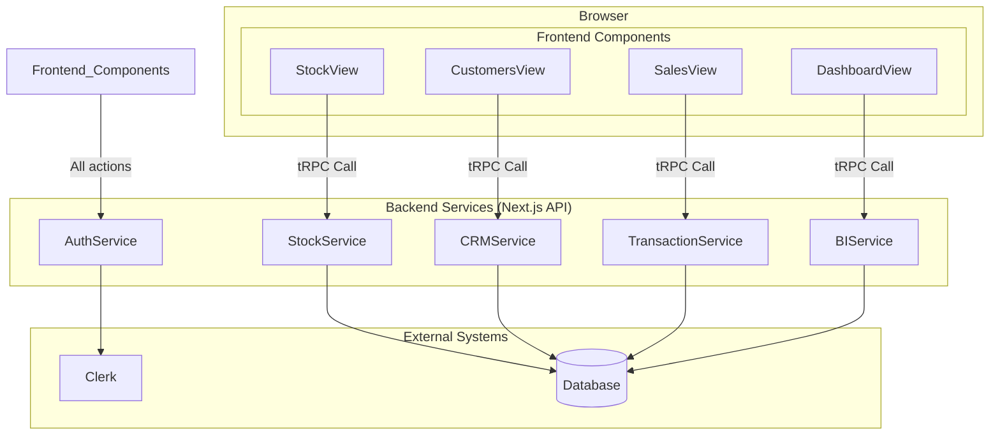

# 6\. Components

We will divide the system's components into two main parts: Backend Components (or Services) that operate behind the scenes, and Frontend Components that users see and interact with.

### Backend Components (Services)

This is a group of logic that will run on the server via Next.js's tRPC API Routes. Each part is responsible for a specific function.

  * **1. Authentication Service**

      * **Responsibility:** Manages everything related to user authentication, such as login, logout, and access control for each API route.
      * **Key Interfaces:** Invoked through tRPC middleware to prevent unauthorized access to data.
      * **Dependencies:** **Clerk** (for managing user sessions and UI).

  * **2. Stock Management Service**

      * **Responsibility:** Manages all logic related to product stock, including CRUD (Create, Read, Update, Delete) operations for **Products, Categories, Units,** and recording **Purchase Records**.
      * **Key Interfaces:** `productRouter`, `categoryRouter`, `unitRouter`, `purchaseRouter`.
      * **Dependencies:** **Prisma Client** (for database connection).

  * **3. CRM Service**

      * **Responsibility:** Manages all logic for customer data (CRUD Customers).
      * **Key Interfaces:** `customerRouter`.
      * **Dependencies:** **Prisma Client**.

  * **4. Transaction Service**

      * **Responsibility:** The heart of the business. Manages the logic for creating and fetching **Sales** and **Repairs** data, including complex stock deduction and cost/profit calculations.
      * **Key Interfaces:** `saleRouter`, `repairRouter`.
      * **Dependencies:** **Prisma Client**, **Stock Management Service** (for updating stock).

  * **5. Business Intelligence (BI) Service**

      * **Responsibility:** Gathers and calculates all summary data to be sent to the Dashboard page, such as total revenue/expenses and data for graphs.
      * **Key Interfaces:** `dashboardRouter`.
      * **Dependencies:** **Prisma Client**.

-----

### Frontend Components

This is the group of UI elements that users will see and interact with on the screen, built with React and Shadcn/ui.

  * **1. UI Layout System**

      * **Responsibility:** The main structure of the web page, providing consistent navigation and responsive design across all application pages.
      * **Components:**
        * **MainLayout Component** (`src/components/layout/main-layout.tsx`): Two-column responsive layout with sidebar and main content area
        * **Sidebar Component** (`src/components/layout/sidebar.tsx`): Fixed navigation with 5 main sections (Dashboard, Stock, Sales, Repairs, Customers)
        * **Header Component** (`src/components/layout/header.tsx`): Top bar with mobile hamburger menu and user controls
      * **Features:**
        * **Desktop:** Permanent sidebar navigation with clean light theme
        * **Mobile:** Sheet-based sliding sidebar with hamburger menu toggle
        * **Active Route Highlighting:** Visual indication of current page location
        * **Accessibility:** Full WCAG compliance with screen reader support
      * **Dependencies:** **Clerk** (UserButton integration), **Shadcn/ui** (Sheet, Button components), **Lucide Icons** (navigation icons).

  * **2. Dashboard View**

      * **Responsibility:** Displays summary data cards and trend graphs.
      * **Dependencies:** **BI Service** (via `dashboardRouter`).

  * **3. Stock, Sales, Repairs, Customers Views**

      * **Responsibility:** A group of pages that perform CRUD operations for each respective section. They consist of data tables (Table), forms for adding/editing (Form), and confirmation dialogs for deletion (Dialog).
      * **Dependencies:** Calls the relevant Backend Service (e.g., Stock Management View will call the Stock Management Service).

  * **4. Shared UI Components**

      * **Responsibility:** A group of reusable components used throughout the app, all implemented using **Shadcn/ui** design system for consistency.
      * **Implemented Components:**
        * **Form Components:** `Button`, `Input` with proper validation states
        * **Data Display:** `Table`, `Card`, `Badge` for organized information presentation
        * **Interactive:** `Dialog`, `Sheet` for modals and mobile navigation
        * **Navigation:** Custom navigation components with `Lucide Icons`
      * **Standards:** All components follow Shadcn/ui design patterns with Tailwind CSS styling
      * **Dependencies:** **Shadcn/ui**, **Radix UI**, **Lucide Icons**, **Tailwind CSS**.

-----

### Component Interaction Diagram

This diagram shows how the various components work together:


