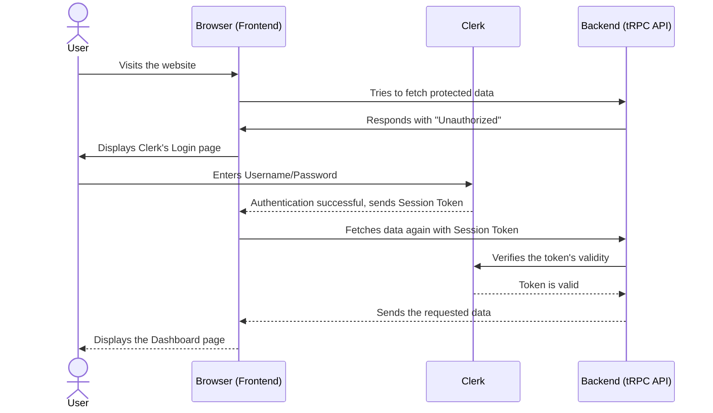
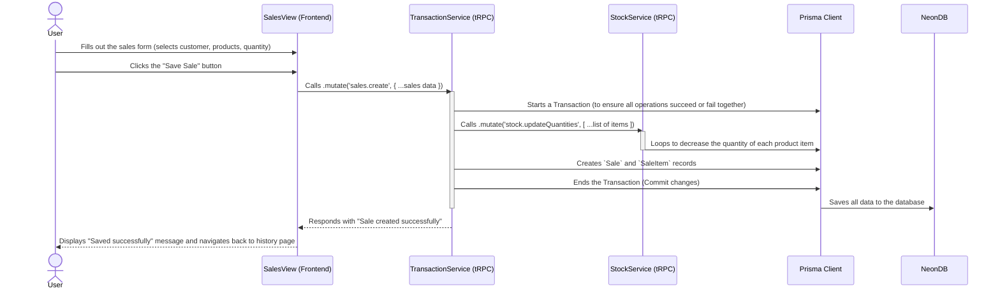

# 8\. Core Workflows

### 1\. User Login & Session Verification Workflow

**Goal:** To show the sequence of operations when a user logs into the system and makes a call to a protected API.

-----

### 2\. Create New Sale Workflow

**Goal:** To show the sequence of operations from when a user clicks to create a new sales invoice to the point of saving the data and deducting product stock, which is a core business workflow.


