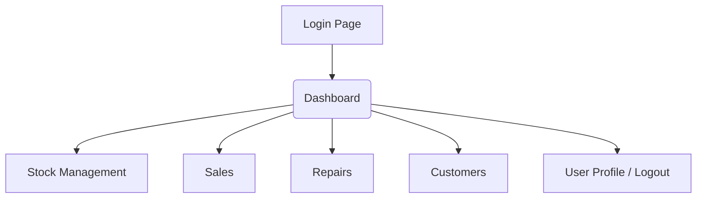

# Repair Shop Back-Office System UI/UX Specification

## 1\. Introduction

### Overall UX Goals & Principles

#### Target User Personas

  * **Primary User:** A repair shop owner/novice developer who needs an easy-to-manage system, wants to reduce time spent on paperwork, and requires accurate summary data for decision-making.

#### Usability Goals

  * **Efficiency:** Able to record a new sale or repair job within 1 minute.
  * **Clarity:** Able to view stock levels and financial summaries instantly and with ease of understanding.
  * **Ease of Learning:** The interface and workflows must be simple and straightforward for users without technical expertise.

#### Design Principles

1.  **Clarity over Cleverness:** Prioritize clarity and ease of understanding above all else.
2.  **Efficiency First:** Design workflows to have the minimum number of clicks for frequently performed tasks.
3.  **Consistency:** The user interface patterns, buttons, and data displays must be consistent across all pages.

## 2\. Information Architecture (IA)

### Site Map / Screen Inventory

Here is the complete sitemap for the system as we defined it in the PRD.



### Navigation Structure

  * **Primary Navigation:** Implemented as a responsive vertical sidebar menu with two different behaviors:
    * **Desktop (≥768px):** Permanently visible 256px-wide sidebar with light theme and clean typography
    * **Mobile (<768px):** Hidden sidebar accessed via hamburger menu button, displayed as sliding overlay using Sheet component
  * **Navigation Items:** Five main sections with Lucide icons and active state highlighting:
    * **Dashboard** (LayoutDashboard icon) → `/dashboard`
    * **Stock** (Boxes icon) → `/stock` 
    * **Sales** (ShoppingCart icon) → `/sales`
    * **Repairs** (Wrench icon) → `/repairs`
    * **Customers** (Users icon) → `/customers`
  * **Active State:** Current page highlighted with blue accent color and visual border indicator
  * **Mobile Navigation:** Sheet-based overlay with proper accessibility (WCAG compliant screen reader support)
  * **User Controls:** Clerk UserButton integrated in header for profile management and sign-out
  * **Secondary Navigation:** Located within each main page as needed (e.g., Categories/Products tabs on Stock page)

## 3\. User Flows

### User Flow: Create a New Sale

  * **User Goal:** To accurately and quickly record a new sales transaction by selecting a customer, adding products, and summarizing the sale.
  * **Entry Points:** Click the "Create New Sale" button from the "Sales" page.
  * **Success Criteria:** A new sales invoice is created successfully, product stock is correctly deducted, and the user is navigated back to the sales list page where the latest invoice is visible.

#### Flow Diagram

```mermaid
graph TD
    A[Sales Page] -->|Click 'Create New Sale'| B(Create Sale Form);
    B --> C{Select Customer};
    C -->|Existing Customer| D[Select from list];
    C -->|New Customer| E[Open 'Add Customer' dialog];
    E --> F[Save new customer info];
    F --> D;
    D --> G[Search and add product];
    G --> H[Specify quantity];
    H --> I{Add more products?};
    I -->|Yes| G;
    I -->|No| J[Review total amount];
    J --> K[Click 'Save Sale'];
    K --> L[System: Save data & deduct stock];
    L --> M[Return to Sales History page];
    M --> N[Display "Save successful" message];

```

#### Edge Cases & Error Handling:

  * What happens if the selected product has insufficient stock?
  * What happens if the user tries to save a sales invoice with no items?
  * What happens if the database connection fails during saving?

## 4\. Wireframes & Mockups

**Primary Design Files:** Will be created by an AI UI tool based on the outlines defined below.

### Key Screen Layouts

#### 1\. Dashboard Page

  * **Purpose:** To provide a quick overview of the business's health on a single page.
  * **Key Elements:**
      * Header: "Dashboard"
      * Time Range Selector: (Dropdown: Today, Last 7 Days, This Month)
      * Row of Summary Cards: (5 cards for Expenses, Repair Income, Sales Income, Sales Profit, Repair Profit)
      * Main Content Area: (For displaying the line trend graph)

#### 2\. Stock Management Page

  * **Purpose:** To view the list of all products and manage stock-related information.
  * **Key Elements:**
      * Header: "Stock Management"
      * Primary Action Buttons: "+ Add New Product", "+ Record Purchase"
      * Sub-menu (Tabs): "Products", "Categories", "Units"
      * Product Data Table: With columns (Name, Category, Quantity, Selling Price, etc.)
      * Action buttons in each table row: (Edit, Delete)

## 5\. Component Library / Design System

### Design System Approach

We will use a **pre-built UI Component Library** to give the application a beautiful and consistent look without building everything from scratch. It is recommended to use **Shadcn/ui**, which is a modern and highly flexible option.

### Core Components

Implemented using **Shadcn/ui** design system with the following components:

  * **Button:** Implemented with variants (default, outline, ghost) for all user actions
  * **Table:** Complete table family (Table, TableHeader, TableBody, TableRow, TableCell) for data display
  * **Card:** Card system (Card, CardHeader, CardTitle, CardContent) for dashboard summary information
  * **Input:** Form input components with validation states and proper accessibility
  * **Dialog:** Modal system (Dialog, DialogContent, DialogHeader, DialogTitle) for confirmations and forms
  * **Sheet:** Mobile navigation overlay system with proper accessibility (SheetContent, SheetTitle, SheetDescription)
  * **Badge:** Status indicators and categorization labels
  * **Layout Components:** Custom MainLayout, Sidebar, and Header components built on Shadcn/ui primitives

### Accessibility Implementation

  * **WCAG Compliance:** Achieved through Radix UI primitives underlying Shadcn/ui components
  * **Screen Reader Support:** Proper ARIA labels and semantic markup throughout
  * **Keyboard Navigation:** Full keyboard accessibility for all interactive elements
  * **Focus Management:** Visible focus indicators and logical tab order

## 6\. Branding & Style Guide

### Color Palette

| Color Type | Hex Code | Usage |
| :--- | :--- | :--- |
| Primary | `#3B82F6` | For primary buttons, links |
| Success | `#22C55E` | For success states |
| Error | `#EF4444` | For error messages |
| Neutral | `#111827` - `#F9FAFB`| For backgrounds, text |

### Typography

  * **Font Families:**
      * **Primary:** **"Prompt"** (Supports Thai, easy to read on screens)
  * **Type Scale:**
      * **H1:** 30px Bold
      * **Body:** 16px Regular

### Iconography

  * **Icon Library:** **Lucide Icons** (0.539.x) implemented throughout the application
  * **Navigation Icons:** LayoutDashboard, Boxes, ShoppingCart, Wrench, Users for main sections
  * **Action Icons:** Plus, Edit, Trash2, Menu, X for user interactions  
  * **Implementation:** Imported from `lucide-react` package with consistent sizing and theming

## 7\. Accessibility Requirements

  * **Standard:** Adhere to **Best Practices**, such as using colors with sufficient contrast, enabling keyboard navigation, and using Semantic HTML.

## 8\. Responsiveness Strategy

**"Mobile-First"** approach implemented with the following breakpoints and behaviors:

  * **Mobile (<768px):** 
    * Hidden sidebar navigation with hamburger menu toggle
    * Sheet-based overlay navigation with smooth animations
    * Single-column layout optimized for touch interaction
    * Clerk UserButton in mobile header for user management
  * **Desktop (≥768px):** 
    * Permanent 256px sidebar with two-column layout
    * Fixed navigation with hover states and active indicators  
    * Optimized for mouse and keyboard interaction
    * UserButton in main header area

## 9\. Animation & Micro-interactions

Animations will be **simple and purposeful**, such as changing color on button hover or a fade-in effect for pop-up dialogs to make the user experience feel smooth.

## 10\. Performance Considerations

  * **Goals:** Fast page load times (under 2.5 seconds) and immediate responsiveness to user actions.
  * **Strategies:** Image compression, loading only necessary components (Lazy Loading).

## 11\. Next Steps

### Immediate Actions

1.  **Handoff to Architect:** Hand this document over to the **Architect** to design the architecture and select the Technology Stack.
2.  **Prepare for AI UI Generation:** After the Architect's work is complete, I can return to help create prompts for the AI UI Generation tool.

-----