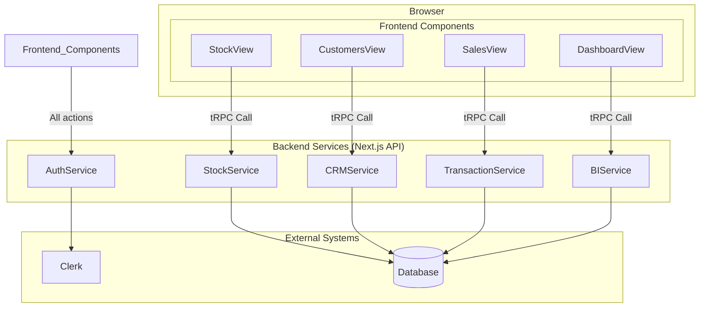
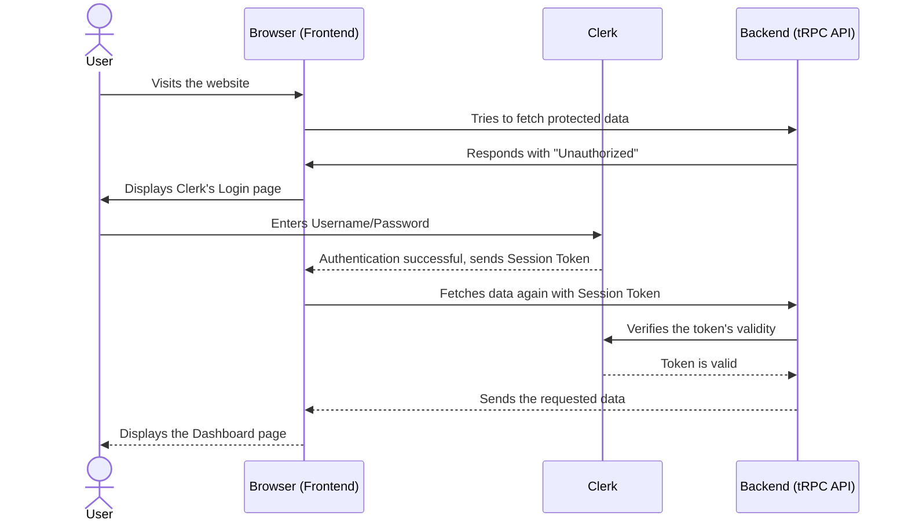
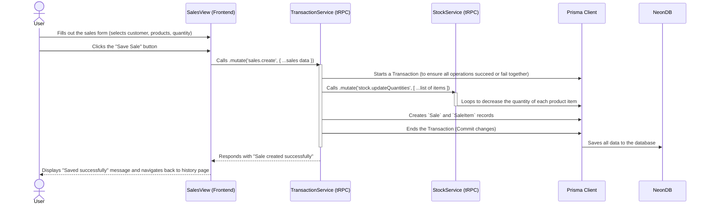
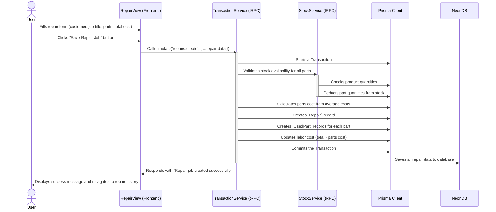

# Fullstack Architecture Document for a Repair Shop Back-Office System

## 1\. Introduction

### **1.1 Document Purpose & Scope**

This document summarizes the entire Full-Stack architecture for the **"Repair Shop Back-Office System"** project. It covers everything from the Backend, Frontend, and all the connections between them. This document will serve as the Single Source of Truth for development, ensuring that the work of the AI Agent and future development proceeds in a unified and consistent direction across the entire system.

### **1.2 Starter Template or Existing Project**

This is the section where I initially asked you, and we have come to a mutual conclusion. I would like to record it in this official document as follows:

  * **Decision:** **N/A - Greenfield project from scratch**
  * **Rationale:** We will build this project from scratch without using any Starter Template to allow for the most flexible architectural design that best fits the project's specific needs.

### **1.3 Change Log**

This section will be used to record future changes made to the architecture document.

| Date | Version | Description | Author |
| :--- | :--- | :--- | :--- |
| 15 Aug 2025 | 1.0 | Initial architecture design | Winston (Architect) |
| 19 Aug 2025 | 1.1 | Updated for Story 4.3: Create New Repair Job implementation | Claude Code |

Excellent\! That's a very good decision. Choosing the T3 Stack will help this project get started quickly with a modern foundation. 👨‍💻

Let's move on to the next step in the architectural design. I will draft the content for the next important section, **"High Level Architecture,"** based on the T3 Stack approach we've selected.

Please review this entire overview and let me know if there are any parts you would like to adjust or if you have any further questions.

-----

## 2\. High Level Architecture

### Technical Summary

The architecture of this project will be a modern Full-Stack application built on **Next.js (T3 Stack)**, combining both the Frontend and Backend API into a single project (Monolith) within a **Monorepo** structure. Communication between the Frontend and Backend will use **tRPC** to achieve maximum Type-Safety. Data will be managed via **Prisma ORM** and stored in a **NeonDB (Serverless Postgres)** database. The authentication system will use services from **Clerk**. All of this will be deployed on the **Vercel** platform for maximum performance, easy management, and low cost, in line with the project's goals.

-----

### Platform and Infrastructure Choice

  * **Platform:** **Vercel**
      * **Rationale:** It's a platform built specifically for Next.js, making deployment fully automated and extremely simple. It includes a built-in Global CDN for speed and has a Free-tier sufficient for this project.
  * **Key Services:**
      * **Vercel:** For Hosting, Serverless Functions (for Backend API), and CI/CD
      * **NeonDB:** For Serverless Postgres Database
      * **Clerk:** For User Authentication and Management

-----

### Repository Structure

  * **Structure:** **Monorepo**
      * **Rationale:** Ideal for a solo developer, it helps manage the entire full-stack codebase in one place, is easy to set up, and facilitates code sharing (e.g., types) between Frontend and Backend.
  * **Monorepo Tool:** **pnpm workspaces** (or npm/yarn workspaces)
      * **Rationale:** It's a tool that comes with pnpm (the recommended Package Manager), is uncomplicated, and is sufficient for a project of this size.

-----

### High Level Architecture Diagram

This diagram shows how the various components of the system work together.

```mermaid
graph TD
    subgraph User
        U[User]
    end

    subgraph Vercel Platform
        subgraph Next.js Application
            FE[Frontend (React Components)]
            API[Backend (tRPC API Routes)]
        end
    end

    subgraph Third-Party Services
        DB[(NeonDB - Postgres)]
        Auth[Clerk Auth]
    end

    U -- HTTPS --> FE;
    FE -- "Login/Signup" --> Auth;
    FE -- "tRPC Calls (Type-Safe)" --> API;
    API -- "Prisma Client" --> DB;
```

-----

### Architectural and Design Patterns

  * **Full-stack Framework (Next.js):** Uses a single framework to manage both Frontend and Backend to reduce complexity.
  * **Serverless Functions:** Our API will be deployed as Serverless Functions on Vercel, which only run when invoked. This helps save costs and supports automatic scaling.
  * **Type-Safe API Layer (tRPC):** This is the core of our data communication, enabling the Frontend and Backend to share types automatically, which drastically reduces errors.
  * **ORM (Prisma):** Acts as the intermediary for communicating with the database, making query writing safer and easier.
  * **Utility-First CSS (Tailwind CSS):** Used for creating a flexible and easily maintainable design system.

## 3\. Tech Stack (Updated Versions - August 2025)

| Category | Technology | **Version (Latest)** | Purpose | Rationale |
| :--- | :--- | :--- | :--- | :--- |
| **Frontend Language** | TypeScript | **5.9.x** | Primary language for Frontend development | Enhances Type-Safety and reduces errors |
| **Frontend Framework**| Next.js (React) | **15.4.x** | Main framework for building UI and managing Backend API | An all-in-one framework, high-performance, and perfectly suited for Vercel |
| **UI Component Library**| Shadcn/ui | **Latest** | A collection of pre-built components for UI creation | Shadcn/ui does not use traditional versioning; it uses the `latest` CLI command to pull the most recent component versions |
| **State Management**| React Hooks / Zustand | N/A | Managing the state of data in the Frontend | Start with React's native tools and add Zustand when needed for complex state, as it's simple and beginner-friendly |
| **Backend Language** | TypeScript | **5.9.x** | Primary language for Backend development | Using the same language as the Frontend allows for easy code and type sharing in a Monorepo |
| **Backend Framework**| Next.js (API Routes) | **15.4.x** | Framework for building the Backend API | It's already included in the Next.js project, simplifying management and creating a complete Monolith |
| **API Style** | tRPC | **11.4.x** | Communication pattern between Frontend-Backend | Provides perfect End-to-End Type-Safety, reducing the complexity of API development |
| **Database** | PostgreSQL (NeonDB) | **17** | Primary database | A Serverless Postgres with a Free-tier, it's easy to manage and powerful, meeting our requirements |
| **ORM** | Prisma | **6.14.x** | Database management intermediary | Makes working with the database easy, secure, and provides excellent Type-Safety |
| **Authentication** | Clerk | Latest Stable | User authentication and management system | Easy to install, comes with pre-built UI, and is highly secure, meeting our needs |
| **Styling** | Tailwind CSS | **4.1.x** | Framework for managing CSS | A highly popular utility-first CSS framework that allows for fast and easily customizable UI development |
| **Testing** | Jest & React Testing Library| **30.0.x (Jest)**| Frontend testing (Unit & Integration) | Standard tools that come with Next.js for testing React Components |
| **CI/CD** | Vercel | N/A | Automated project deployment | Connects to a Git repository (e.g., GitHub) and deploys automatically on every code push |
| **Iconography** | Lucide Icons | **0.539.x** | Icon set for use in the UI | The recommended icon set in the `UI/UX Spec` and works well with React |

## 4\. Data Models

### 1\. Category (Product Category)

  * **Purpose:** Used for grouping products to facilitate easy management and searching.
  * **Key Attributes:**
      * `id`: `String` - Unique ID
      * `name`: `String` - Category name (e.g., "Screen Parts", "Batteries")
  * **Relationships:**
      * One Category can have many Products (One-to-Many).

#### TypeScript Interface

```typescript
interface Category {
  id: string;
  name: string;
}
```

### 2\. Unit (Unit of Measure)

  * **Purpose:** Used for defining the unit for each product item.
  * **Key Attributes:**
      * `id`: `String` - Unique ID
      * `name`: `String` - Unit name (e.g., "piece", "strip", "box")
  * **Relationships:**
      * One Unit can be used for many Products (One-to-Many).

#### TypeScript Interface

```typescript
interface Unit {
  id: string;
  name: string;
}
```

### 3\. Product (Product)

  * **Purpose:** The main model for storing information about all products and parts in stock.
  * **Key Attributes:**
      * `id`: `String` - Unique ID
      * `name`: `String` - Product name
      * `salePrice`: `Float` - Selling price per unit
      * `quantity`: `Int` - Quantity remaining in stock (will start at 0)
      * `averageCost`: `Float` - Average cost per unit (will start at 0)
      * `createdAt`: `DateTime` - Data creation date
      * `updatedAt`: `DateTime` - Last data update date
  * **Relationships:**
      * One Product belongs to only one **Category** (Many-to-One).
      * One Product has only one **Unit** of measure (Many-to-One).
      * One Product can have many **Purchase Records**.
      * One Product can be in many **Sale Items**.
      * One Product can be a **Used Part** in multiple repair jobs.

#### TypeScript Interface

```typescript
interface Product {
  id: string;
  name: string;
  salePrice: number;
  quantity: number;
  averageCost: number;
  categoryId: string;
  unitId: string;
  createdAt: Date;
  updatedAt: Date;
}
```

### 4\. Purchase Record (Purchase Record)

  * **Purpose:** Used to record the history of each stock purchase, which is necessary for calculating the average cost and updating inventory quantities.
  * **Key Attributes:**
      * `id`: `String` - Unique ID
      * `quantity`: `Int` - Quantity purchased in that transaction
      * `costPerUnit`: `Float` - Cost per unit for that purchase
      * `purchaseDate`: `DateTime` - Date of purchase
  * **Relationships:**
      * One Purchase Record must always be linked to one **Product** (Many-to-One).

#### TypeScript Interface

```typescript
interface PurchaseRecord {
  id: string;
  productId: string;
  quantity: number;
  costPerUnit: number;
  purchaseDate: Date;
}
```

### 5\. Customer (Customer)

  * **Purpose:** A model for storing all customer information, used for reference when creating sales or repair jobs.
  * **Key Attributes:**
      * `id`: `String` - Unique ID
      * `name`: `String` - Customer name
      * `phone`: `String` - Phone number (Optional)
      * `address`: `String` - Address (Optional)
      * `createdAt`: `DateTime` - Data creation date
  * **Relationships:**
      * One Customer can have many **Sales** (One-to-Many).
      * One Customer can have many **Repairs** (One-to-Many).

#### TypeScript Interface

```typescript
interface Customer {
  id: string;
  name: string;
  phone?: string;
  address?: string;
  createdAt: Date;
}
```

### 6\. Sale (Sale Transaction)

  * **Purpose:** Used to store information for each sale, including a summary and the list of items sold.
  * **Key Attributes:**
      * `id`: `String` - Unique ID
      * `totalAmount`: `Float` - Net total of the sales invoice
      * `totalCost`: `Float` - Total cost of goods sold on this invoice
      * `createdAt`: `DateTime` - Date and time the sale was created
  * **Relationships:**
      * One Sale must be linked to one **Customer** (Many-to-One).
      * One Sale can have many **Sale Items** (One-to-Many).

#### TypeScript Interface

```typescript
interface Sale {
  id: string;
  customerId: string;
  totalAmount: number;
  totalCost: number;
  createdAt: Date;
}
```

### 7\. Sale Item (Sale Item)

  * **Purpose:** A "child table" of Sale, used to store the details of each individual item sold in that transaction.
  * **Key Attributes:**
      * `id`: `String` - Unique ID
      * `quantity`: `Int` - Quantity sold
      * `priceAtTime`: `Float` - Selling price at the time of sale (copied from the Product's `salePrice`)
      * `costAtTime`: `Float` - Cost at the time of sale (copied from the Product's `averageCost`)
  * **Relationships:**
      * One Sale Item must belong to only one **Sale** (Many-to-One).
      * One Sale Item must be linked to one **Product** (Many-to-One).

#### TypeScript Interface

```typescript
interface SaleItem {
  id: string;
  saleId: string;
  productId: string;
  quantity: number;
  priceAtTime: number;
  costAtTime: number;
}
```

### 8\. Repair (Repair Job)

  * **Purpose:** Used to store information for each repair job, including costs and parts used.
  * **Key Attributes:**
      * `id`: `String` - Unique ID
      * `description`: `String` - Description of the repair job
      * `totalCost`: `Float` - Total repair price charged to the customer
      * `partsCost`: `Float` - Total cost of all parts used
      * `laborCost`: `Float` - Labor cost (calculated from `totalCost` - `partsCost`)
      * `createdAt`: `DateTime` - Date and time the repair job was created
  * **Relationships:**
      * One Repair must be linked to one **Customer** (Many-to-One).
      * One Repair can have many **Used Parts** (One-to-Many).

#### TypeScript Interface

```typescript
interface Repair {
  id: string;
  customerId: string;
  description: string;
  totalCost: number;
  partsCost: number;
  laborCost: number;
  createdAt: Date;
}
```

### 9\. Used Part (Part Used in Repair)

  * **Purpose:** A "child table" of Repair, used to record which parts (Products) were used in that specific repair job.
  * **Key Attributes:**
      * `id`: `String` - Unique ID
      * `costAtTime`: `Float` - Cost of the part at the time it was used (copied from the Product's `averageCost`)
  * **Relationships:**
      * One Used Part must belong to only one **Repair** (Many-to-One).
      * One Used Part must be linked to one **Product** (Many-to-One).

#### TypeScript Interface

```typescript
interface UsedPart {
  id: string;
  repairId: string;
  productId: string;
  costAtTime: number;
}
```

Understood\! Now that we have a solid data structure, the next step is to design the "gateway" that will allow the Frontend to securely and systematically access the Backend's data and functions.

-----

## 5\. API Specification

Since we have chosen to use **tRPC**, a modern technology, we don't need to create traditional API documentation (like OpenAPI or Swagger). Instead, we will define what are called **"Routers,"** which are groups of Backend functions categorized to make them easy for the Frontend to call.

Our approach is to create a main router (`appRouter`) that will aggregate the sub-routers for each feature. The structure will look like this:

### tRPC Router Definitions

We will organize our API according to the data model groups we designed. Here is the code structure that will serve as the blueprint for our API:

```typescript
import { initTRPC } from '@trpc/server';
import { z } from 'zod'; // Zod is a library used for input validation

const t = initTRPC.create();

// =================================================================
// Sub-routers for managing each data entity
// =================================================================

const categoryRouter = t.router({
  // Ex: Function to fetch all categories
  getAll: t.procedure.query(() => {
    // ... code to fetch Categories from the database
  }),
  // ... other CRUD functions for Category
});

const unitRouter = t.router({
  // ... CRUD functions for Unit
});

const productRouter = t.router({
  // ... CRUD functions for Product
});

const purchaseRouter = t.router({
  // ... functions for recording purchases
});

const customerRouter = t.router({
  // ... CRUD functions for Customer
});

const saleRouter = t.router({
  // ... functions for creating and viewing sales
});

const repairRouter = t.router({
  // CRUD functions for Repair management
  getAll: t.procedure.query(() => {
    // Fetch all repair jobs with customer and used parts details
  }),
  getById: t.procedure
    .input(z.object({ id: z.string() }))
    .query(({ input }) => {
      // Fetch single repair job with detailed breakdown
    }),
  create: t.procedure
    .input(z.object({
      customerId: z.string(),
      jobTitle: z.string(), // Job title/description
      totalCost: z.number(),
      usedParts: z.array(z.object({
        productId: z.string(),
        quantity: z.number()
      }))
    }))
    .mutation(({ input }) => {
      // Create repair job, deduct stock, calculate costs
    })
});

const dashboardRouter = t.router({
  // Function to fetch summary data for the Dashboard
  getSummary: t.procedure
    .input(z.object({ period: z.enum(['today', 'last7days', 'thismonth']) }))
    .query(({ input }) => {
      // ... code to fetch summary data based on the specified time period
    }),
});


// =================================================================
// The main router that combines everything
// =================================================================
export const appRouter = t.router({
  categories: categoryRouter,
  units: unitRouter,
  products: productRouter,
  purchases: purchaseRouter,
  customers: customerRouter,
  sales: saleRouter,
  repairs: repairRouter,
  dashboard: dashboardRouter,
});

// Export the type of the AppRouter for Frontend use
export type AppRouter = typeof appRouter;

```

### **Description:**

  * **`t.router`**: Used to create a group of API endpoints.
  * **`t.procedure`**: Used to create an individual endpoint.
  * **`.query`**: For endpoints that **fetch/read** data (e.g., `getAll`).
  * **`.mutation`**: For endpoints that **create/edit/delete** data (e.g., `create`, `update`, `delete`).
  * **`.input(z.object(...))`**: Uses **Zod** to define the shape and data types of the input required for an endpoint, which tRPC will use for automatic validation.

## 6\. Components

We will divide the system's components into two main parts: Backend Components (or Services) that operate behind the scenes, and Frontend Components that users see and interact with.

### Backend Components (Services)

This is a group of logic that will run on the server via Next.js's tRPC API Routes. Each part is responsible for a specific function.

  * **1. Authentication Service**

      * **Responsibility:** Manages everything related to user authentication, such as login, logout, and access control for each API route.
      * **Key Interfaces:** Invoked through tRPC middleware to prevent unauthorized access to data.
      * **Dependencies:** **Clerk** (for managing user sessions and UI).

  * **2. Stock Management Service**

      * **Responsibility:** Manages all logic related to product stock, including CRUD (Create, Read, Update, Delete) operations for **Products, Categories, Units,** and recording **Purchase Records**.
      * **Key Interfaces:** `productRouter`, `categoryRouter`, `unitRouter`, `purchaseRouter`.
      * **Dependencies:** **Prisma Client** (for database connection).

  * **3. CRM Service**

      * **Responsibility:** Manages all logic for customer data (CRUD Customers).
      * **Key Interfaces:** `customerRouter`.
      * **Dependencies:** **Prisma Client**.

  * **4. Transaction Service**

      * **Responsibility:** The heart of the business. Manages the logic for creating and fetching **Sales** and **Repairs** data, including complex stock deduction and cost/profit calculations.
      * **Key Interfaces:** `saleRouter`, `repairRouter`.
      * **Dependencies:** **Prisma Client**, **Stock Management Service** (for updating stock).

  * **5. Business Intelligence (BI) Service**

      * **Responsibility:** Gathers and calculates all summary data to be sent to the Dashboard page, such as total revenue/expenses and data for graphs.
      * **Key Interfaces:** `dashboardRouter`.
      * **Dependencies:** **Prisma Client**.

-----

### Frontend Components

This is the group of UI elements that users will see and interact with on the screen, built with React and Shadcn/ui.

  * **1. UI Layout System**

      * **Responsibility:** The main structure of the web page, consisting of a **Sidebar** for navigation and a content area for displaying the main content of each page.
      * **Dependencies:** **Clerk** (to display user information and a Logout button).

  * **2. Dashboard View**

      * **Responsibility:** Displays summary data cards and trend graphs.
      * **Dependencies:** **BI Service** (via `dashboardRouter`).

  * **3. Stock, Sales, Repairs, Customers Views**

      * **Responsibility:** A group of pages that perform CRUD operations for each respective section. They consist of data tables (Table), forms for adding/editing (Form), and confirmation dialogs for deletion (Dialog).
      * **Dependencies:** Calls the relevant Backend Service (e.g., Stock Management View will call the Stock Management Service).

  * **4. Shared UI Components**

      * **Responsibility:** A group of components used repeatedly throughout the app, such as `Button`, `Table`, `Card`, `Input`, most of which will come from **Shadcn/ui**.
      * **Dependencies:** N/A.

-----

### Component Interaction Diagram

This diagram shows how the various components work together:



## 7\. External APIs

Based on our architectural design, the system will connect to only one primary external API: **Clerk** for authentication. The connection to the **NeonDB** database will be managed entirely through the Prisma ORM, so we will not need to call NeonDB's API directly.

### Clerk Authentication API

  * **Purpose:** To manage the entire user authentication and management process, from registration, login, session management, to protecting web pages and APIs.
  * **Documentation:** [https://clerk.com/docs](https://clerk.com/docs)
  * **Authentication:** The connection will use **API Keys (Publishable Key and Secret Key)**, which will be stored securely in the project's Environment Variables (`.env`).
  * **Rate Limits:** Clerk's Free-tier offers a high number of users and requests, sufficient for this project's initial phase. Details can be found on Clerk's pricing page.
  * **Key Endpoints Used:** We will not be calling Clerk's REST API directly but will use their **Official SDK (`@clerk/nextjs`)**, which provides ready-made tools such as:
      * Components: `<SignIn />`, `<SignUp />`, `<UserButton />` for quickly building UI pages.
      * Hooks: `useUser()`, `useAuth()` for fetching data of the logged-in user.
      * Middleware: `authMiddleware()` for protecting our tRPC API routes.
  * **Integration Notes:** The Clerk Middleware setup in Next.js will act as an intermediary that inspects every request coming to our Backend API to ensure the user is authorized to access that data.

## 8\. Core Workflows

### 1\. User Login & Session Verification Workflow

**Goal:** To show the sequence of operations when a user logs into the system and makes a call to a protected API.



-----

### 2\. Create New Sale Workflow

**Goal:** To show the sequence of operations from when a user clicks to create a new sales invoice to the point of saving the data and deducting product stock, which is a core business workflow.



-----

### 3\. Create New Repair Job Workflow

**Goal:** To show the sequence of operations for creating a repair job, including selecting parts, calculating costs, and managing inventory deductions.



## 9\. Database Schema

In this section, we will convert all the Data Models we designed in Section 4 into code that **Prisma** can understand to generate our PostgreSQL database. This file is typically named `schema.prisma`.

### Prisma Schema Definition

```prisma
// This is your Prisma schema file,
// learn more about it in the docs: https://pris.ly/d/prisma-schema

// 1. Define the database provider
datasource db {
  provider = "postgresql"
  url      = env("DATABASE_URL") // Pulled from the .env file
}

// 2. Define the Prisma Client to be generated
generator client {
  provider = "prisma-client-js"
}

// =================================================================
// Data Models
// =================================================================

model Category {
  id       String    @id @default(cuid())
  name     String    @unique
  products Product[] // Relation: One Category can have many Products
}

model Unit {
  id       String    @id @default(cuid())
  name     String    @unique
  products Product[] // Relation: One Unit can have many Products
}

model Product {
  id            String    @id @default(cuid())
  name          String
  salePrice     Float
  quantity      Int       @default(0)
  averageCost   Float     @default(0)
  createdAt     DateTime  @default(now())
  updatedAt     DateTime  @updatedAt

  // Relations
  category      Category   @relation(fields: [categoryId], references: [id])
  categoryId    String
  unit          Unit       @relation(fields: [unitId], references: [id])
  unitId        String
  
  purchaseRecords PurchaseRecord[]
  saleItems       SaleItem[]
  usedParts       UsedPart[]
}

model PurchaseRecord {
  id           String   @id @default(cuid())
  quantity     Int
  costPerUnit  Float
  purchaseDate DateTime @default(now())

  // Relation
  product      Product @relation(fields: [productId], references: [id])
  productId    String
}

model Customer {
  id        String   @id @default(cuid())
  name      String
  phone     String? // ? means optional field
  address   String?
  createdAt DateTime @default(now())

  // Relations
  sales     Sale[]
  repairs   Repair[]
}

model Sale {
  id          String     @id @default(cuid())
  totalAmount Float
  totalCost   Float
  createdAt   DateTime   @default(now())

  // Relations
  customer    Customer   @relation(fields: [customerId], references: [id])
  customerId  String
  saleItems   SaleItem[]
}

model SaleItem {
  id          String @id @default(cuid())
  quantity    Int
  priceAtTime Float
  costAtTime  Float

  // Relations
  sale        Sale    @relation(fields: [saleId], references: [id])
  saleId      String
  product     Product @relation(fields: [productId], references: [id])
  productId   String
}

model Repair {
  id          String     @id @default(cuid())
  description String
  totalCost   Float
  partsCost   Float
  laborCost   Float
  createdAt   DateTime   @default(now())

  // Relations
  customer    Customer   @relation(fields: [customerId], references: [id])
  customerId  String
  usedParts   UsedPart[]
}

model UsedPart {
  id         String @id @default(cuid())
  costAtTime Float

  // Relations
  repair     Repair  @relation(fields: [repairId], references: [id])
  repairId   String
  product    Product @relation(fields: [productId], references: [id])
  productId  String
}
```

## 10\. Unified Project Structure

```plaintext
/my-repair-shop-app/
├── prisma/
│   └── schema.prisma         # The file we designed in Section 9 for defining the DB structure
│
├── public/
│   ├── favicon.ico           # The website's favicon
│   └── ...                   # Other public files like images, fonts
│
├── src/
│   ├── app/                  # Main folder for Next.js App Router (web pages)
│   │   ├── (auth)/           # Group of pages related to authentication (e.g., sign-in, sign-up)
│   │   ├── (main)/           # Group of main pages after login (Dashboard, Stock, etc.)
│   │   │   ├── dashboard/
│   │   │   │   └── page.tsx    # Code for the Dashboard page
│   │   │   ├── layout.tsx    # Main layout with the Sidebar
│   │   │   └── ...           # Folders for other pages
│   │   ├── api/                # Folder for the tRPC API
│   │   │   └── trpc/[...trpc]/ # Entrypoint for the tRPC API called by the Frontend
│   │   │       └── route.ts
│   │   ├── layout.tsx          # Root layout for the entire application
│   │   └── page.tsx            # The first page of the site (Homepage/Login)
│   │
│   ├── components/
│   │   └── ui/                 # Components from Shadcn/ui that we will install
│   │
│   ├── lib/
│   │   ├── db.ts               # Code for connecting the Prisma Client
│   │   └── utils.ts            # Reusable helper functions
│   │
│   └── server/
│       ├── api/
│       │   ├── routers/        # Folder to store tRPC sub-routers (e.g., product.ts, sale.ts)
│       │   │   └── _app.ts     # The main appRouter file that combines all routers (as per Section 5)
│       │   └── root.ts         # Main tRPC file
│       └── auth.ts             # Authentication-related configurations
│
├── .env                        # File to store Environment Variables (e.g., DATABASE_URL, CLERK_SECRET_KEY)
├── .eslintrc.json              # Configuration for the Linter (code quality checks)
├── next.config.mjs             # Next.js configuration file
├── package.json                # Project dependencies management file
├── postcss.config.js           # Configuration for Tailwind CSS
├── tailwind.config.ts          # Configuration for Tailwind CSS
└── tsconfig.json               # Configuration for TypeScript
```

-----

### **Description:**

  * **`prisma/`**: Specifically for storing the database schema.
  * **`src/app/`**: The heart of the Frontend, following Next.js App Router standards.
  * **`src/components/`**: Stores reusable React Components for the entire app.
  * **`src/server/api/routers/`**: The heart of the Backend where we will create all our tRPC functions.

## 11\. Implementation & Development Standards

This section summarizes all the standards and best practices that will be used in developing, testing, and deploying our application.

### 11.1 Coding Standards & Naming Conventions

This is the section we just summarized and agreed upon, which consists of 5 key rules and naming standards to guide the AI Agent's work.

-----

### 11.2 Testing Strategy

  * **Testing Philosophy:** We will adopt the **Testing Pyramid** approach, focusing primarily on Unit Tests, followed by Integration Tests, and End-to-End (E2E) Tests for critical user flows.
  * **Unit & Integration Tests:** We will use **Jest** and **React Testing Library**, which come with Next.js, to test Backend logic and Frontend components.
  * **End-to-End (E2E) Tests:** It is recommended to use **Playwright** for future E2E testing to simulate real user interactions from start to finish.
  * **Requirement:** Critical business logic, such as average cost calculation, stock deduction, and profit calculation, must always be covered by Unit Tests.

-----

### 11.3 Development Workflow

  * **Local Setup:** Developers can set up the entire project with the `pnpm install` command.
  * **Running the App:** Use the `pnpm dev` command to run the entire application (both Frontend and Backend) in Development Mode.
  * **Database Management:**
      * Use `pnpm prisma migrate dev` to update the database structure according to `schema.prisma`.
      * Use `pnpm prisma studio` to open a web interface for directly viewing and editing data in the database.

-----

### 11.4 Security

  * **Authentication & Authorization:** Handled entirely by **Clerk**. All API routes related to sensitive data will be protected by tRPC's `protectedProcedure`, which only allows logged-in users to access them.
  * **Input Validation:** All data sent from the user will be strictly validated on the backend using **Zod** within tRPC routers to prevent invalid data.
  * **Secrets Management:** All API Keys and Connection Strings will be stored in the `.env` file and will not be exposed in the frontend code.

-----

### 11.5 Deployment

  * **Platform:** **Vercel**
  * **Process:** Deployment will be automated upon pushing code to the Git repository (e.g., GitHub) on the `main` branch.
  * **Environments:** Vercel will manage the Production Environment and automatically create Preview Environments for testing new features.

-----

### 11.6 Error Handling & Monitoring

  * **Error Handling:** tRPC has an excellent built-in error handling system. When an error occurs on the Backend, the Frontend will receive a well-typed error, making it easy to display user-friendly error messages.
  * **Logging & Monitoring:** For the first version (MVP), we will use the **Vercel Logs** and **Vercel Analytics** systems that come with the platform, requiring no additional setup, to monitor the application's performance and errors.